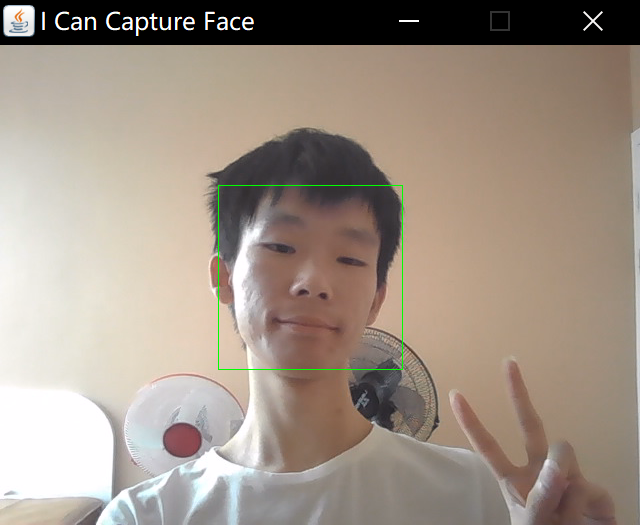
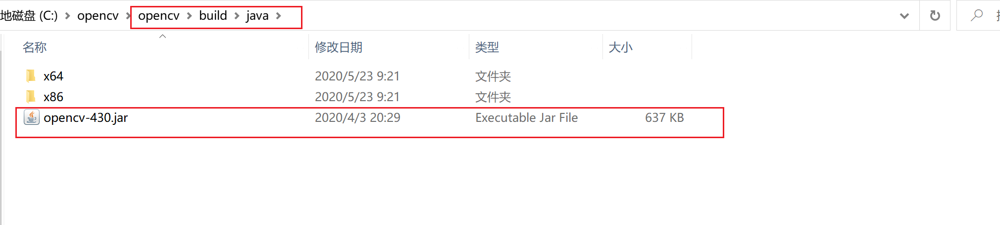
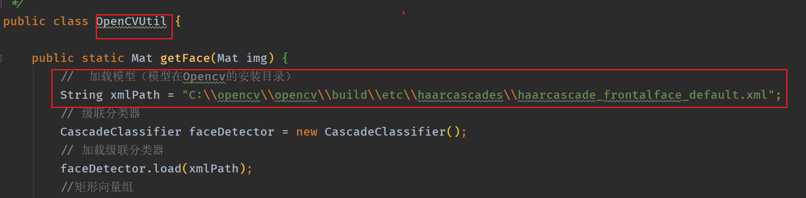
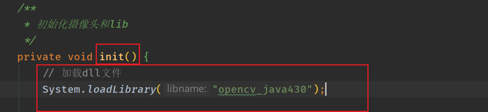

### 效果图如下所示

### 使用说明

本项目是由IDEA进行构建，使用OpenCV的版本如下：

- OpenCV：4.3.0

程序通过使用OpenCV调用摄像头获得图片，然后识别人脸的模型也是opecv提供的。

IDEA构建项目注意点：

1. 需要将OpenCV的Jar包导入，Jar包目录在安装目录下：
 

2. 需要将dll文件进行导入:

IDEA导入方式如下：

然后选择分别选择Jar包和dll文件即可。

在代码类`OpenCVUtil`中，需要将模型路径替换成自己的文件夹路径：

在代码类`ShowImgUtil`的`init()`函数中，需要将dll文件名替换成自己导入的dll版本（我这里是`opencv_java430`）：

然后程序就可以运行了！！！

